# The Qlik Replicate Kubernetes Demo

The files in this directory contain all you will need to stand up a fully functional
Qlik Replicate demo in a *Minikube* environment.

## Required Software

To run the demo, you will need to have 3 bits of software installed:

* *Docker* must be installed and running, and the user must have the necessary 
permissions to use it. By default, the *root* user on Linux systems is the only
user with permission, but other users may be granted access by adding them to the
*docker* group.
* [Minikube](https://minikube.sigs.k8s.io/docs/) unless you already have a 
Kubernetes cluster to work with. Note that we have only tested this demo with Minikube.
* The [kubectl](https://kubernetes.io/docs/reference/kubectl/kubectl/) 
CLI. *Kubectl* interacts with the Kubernetes cluster manager to deploy and manage pods, etc.

## Running the Demo

Follow these steps to run the demo.

### Start Minikube

```bash
minikube start --driver=docker
```

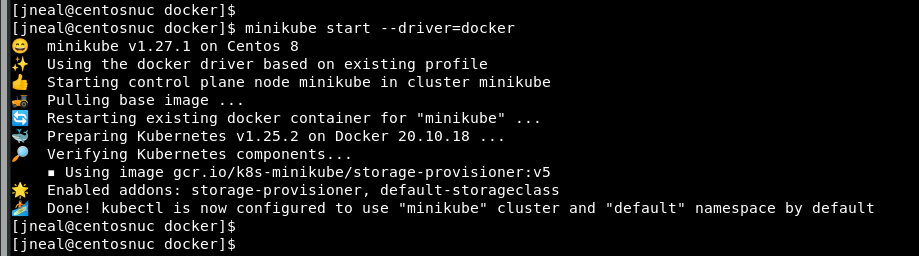

### Create a Qlik Replicate License 'Secret'

If you want to provide a license file to your Qlik Replicate environment, you
can do so by creating a Kubernetes secret containing the details of your
Qlik Replicate license. 

Run the script as follows:
```
[demo]$ ./license-secret.sh license.txt 
*** converting license file to JSON format
No resources found in default namespace.
secret/repl-license created
[demo]$ 

```
> Note: This step is not required. You can also copy and paste your license file
> into your Qlik Replicate console. However, this approach using the secret should
> be considered best practice as it will be available to Qlik Replicate on whichever
> node in your cluster that it is deployed on.

### Push your Qlik Replicate Image to Minikube

```bash
minikube image load replicate:k8s
```

### Start the Pods
The script *run-demo.sh* starts 4 Kubernetes pods: 

* MySQL, 
* Postgres, 
* Qlik Replicate, 
* and Dbloadgen. [Dbloadgen](https://github.com/Qlik-PE/DbLoadgen) is an 
open source utility for generating test loads against 
a database, especially useful in cases like this where you want to test CDC. 

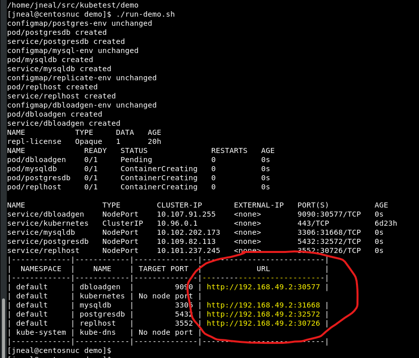

The output at the end of the script's execution will provide you with the
IP addresses and ports you will use to access the resources in each pod.

### Configure Qlik Replicate

> We assume that you know your way around Qlik Replicate already. 
> There are a number of screenshots below that will assist in configuration, but this
> is not intended to be a detailed, step-by-step tutorial.

Access Qlik Replicate from your browser using the IP address and port 
listed in the output from *run-demo.sh*. The user name will be `admin`
and the password will be `AttunityAdmin123` (unless you changed it in 
the *replicate.yaml* file). Your URL should look something like this:

```text
http://192.168.49.2:31020/attunityreplicate
```
> Note: if you do not provide SSL certificates, Qlik Replicate will generate a self-signed
> certificate. In this case, you will likely get prompted that there might be 
> a security risk. This is to be expected with self-signed SSL certificate. Simply accept
> the risk and continue. The screenshot below shows the process in Firefox. The
> process may vary slightly depending on your browser.

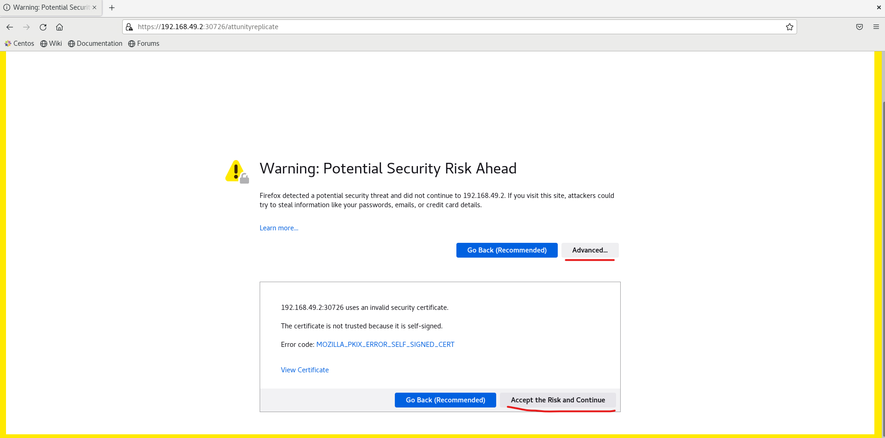

and then sign in:

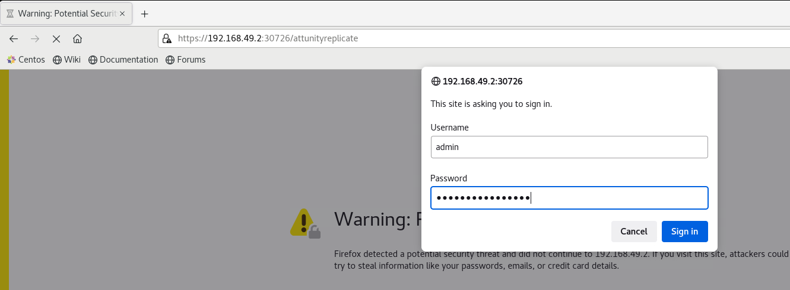

### Use Dbloadgen to Initialize the MySQL Source

Use your browser to connect to *Dbloadgen* and configure it to connect to 
the MySQL source database. The user name is `admin` and the password is `admin`.
Select the *Connection Name* `mysqltest`.
Use the IP address and port that were output from *run-demo.sh* to access *Dbloadgen*
and the IP address and port for MySQL when configuring connectivity.

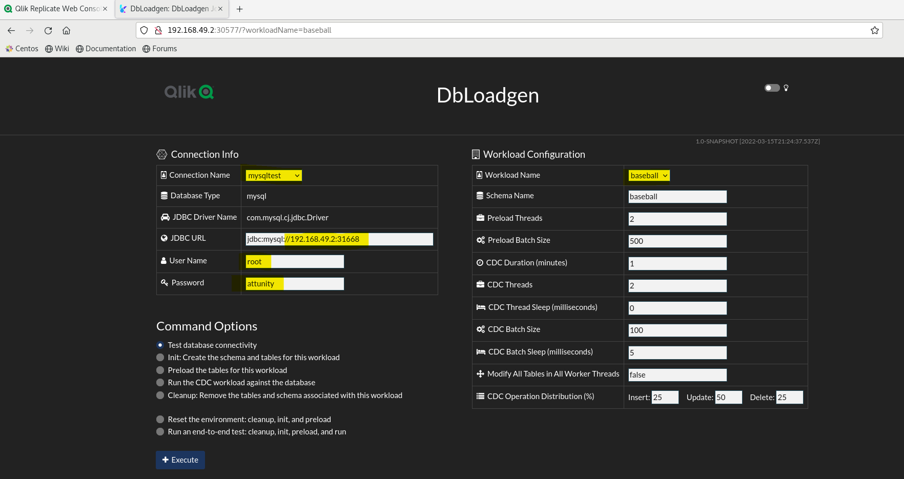

Next, select the `baseball` workload, and then ask *dbloadgen* to initialize the schema and
then preload the tables.

### Configure a MySQL Source

Configure a connection to the MySQL pod using the IP address and port for the MySQL pod
that was output from *run-demo.sh*. The user is `root` and the password is `attunity`.

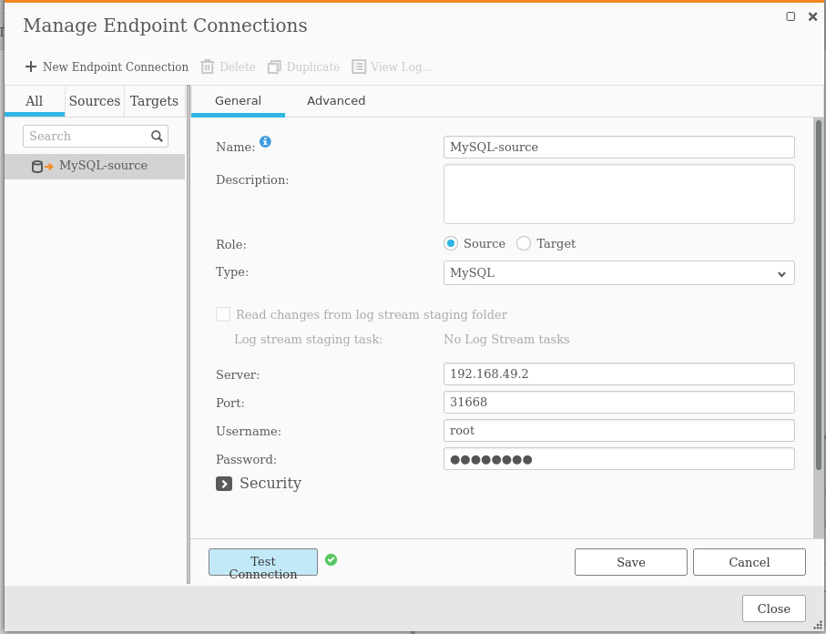

### Configure a PostgreSQL Target

Configure a connection to the Postgres pod using the IP address and port for the Postgres pod
that was output from *run-demo.sh*. The user is `qlik`,  the password is `attunity`, and the
database is `qlikdb`.

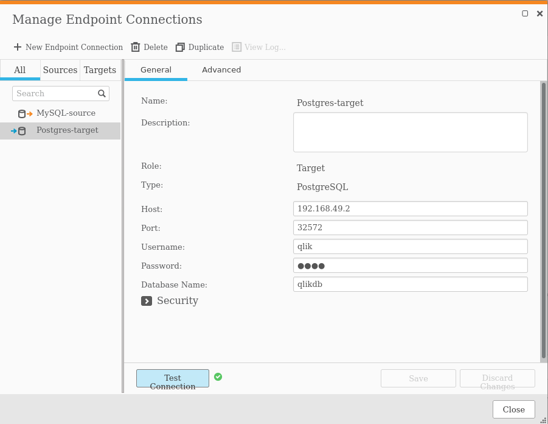


### Configure and Run a Qlik Replicate Task

Configure a Qlik Replicate task using the endpoints your defined and the
data that you initialized using *dbloadgen*.

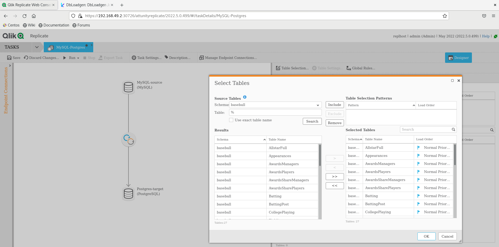

Now save and run the task.

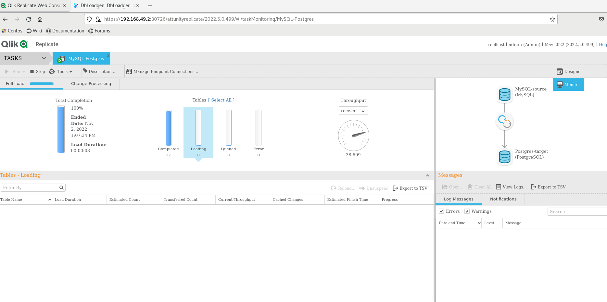

Qlik Replicate's full load process has just run, but we haven't yet put any CDC load against
the database. 

* In the Replicate window, switch over to the "Change Processing" tab.
* In the *Dbloadgen* window, ask *dbloadgen* to run a CDC load. If you leave the
configuration parameters at their defaults, it will generate a CDC workload for 1
minute. 

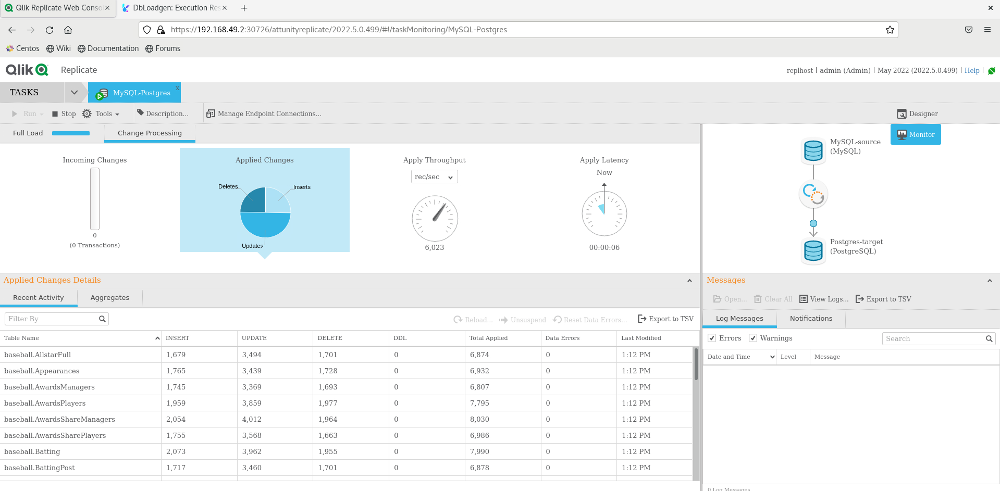


### Cleanup the Demo

When you are done testing, you can execute the *cleanup-demo.sh* script.

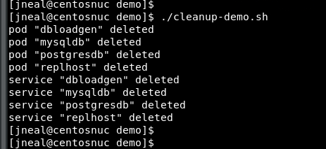

And stop minikube:

```
minikube stop
```

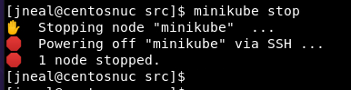


