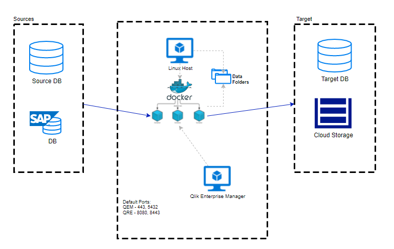

# Qlik Replicate Running on Docker

Pedro Bergo - PS Team

November, 2023

## Table of Contents

[Introduction](#introduction)

[Premises](#premises)

[Steps to install Qlik Replicate on Docker](#steps)

[Install Docker](#install-docker)

[Download files](#download-files)

[Adjusting the scripts](#adjust-scripts)

[Build Docker Image](#build-image)

[Run Qlik Replicate on Docker](#run-replicate)

[Docker command examples](#docker-reference)

[Upgrading Qlik Replicate on Docker](#upgrading)

<a id="introduction"></a>
## Introduction

This document was created to provide details about using Qlik Replicate inside Docker environment. The information here doesn´t intend to cover all aspects of Docker environments, flavours and tools provided by market, like Swarm, Kubernettes or AWS-EKS.

The recommended approach for PS consultants during the project implementation is provide to customers basic information and artifacts (scripts and configuration files) to work with Docker, then it can be adapted to its own environments.

<a id="premises"></a>
# Premises

Following the premises to install Qlik Replicate using Docker:

1.  Linux Host machine, on my tests I use following OS

    a.  Ubuntu 20.04

    b.  RedHat 8

    c.  CentOS 7.5

    d.  Windows Server 2019

2.  Persistent Storage: Qlik Replicate will store the data on a persistent storage, shared through the network and mounted inside Docker Container. As Replicate needs, this storage must be physical storage, like physical disk, EBS volume or Azure disks.

3.  Fixed IP address and Port to reach out the Replicate container by     users or QEM.

4.  The example on this document uses MySQL and MS SQL Server ODBC driver and Qlik Replicate May 2023 version.

> 

<a id="steps"></a>
# Steps to install Qlik Replicate on Docker

1)  Install Docker

2)  Download files

    a.  ODBC drivers

    b.  Qlik Replicate Linux installer

    c.  Qlik Replicate Dockerfile Generator

3)  Adjust the scripts

4)  Build Docker Image

5)  Run Qlik Replicate on Docker

<a id="install-docker"></a>
# Install Docker

This section provides information to prepare machine to run Docker.
Following script example works on CentOS 7.5

Tip:

-   You can use many different Linux distributions since the Docker
    image use specific versions of it.

```shell
#Update SO
sudo yum -y update

#Install packages
sudo yum -y install openssh-server openssh-clients
sudo yum install -y yum-utils
sudo yum -y install epel-release

#Enable extra repository
sudo yum repolist

#Remove old Docker installations
sudo yum remove docker docker-client docker-client-latest docker-common docker-latest docker-latest-logrotate docker-logrotate docker-engine

#Add docker repo
sudo yum-config-manager --add-repo
<https://download.docker.com/linux/centos/docker-ce.repo>

#Install docker-engine Community Edition
sudo yum -y install docker-ce docker-ce-cli containerd.io docker-compose-plugin

#Start docker
sudo systemctl start docker

#Make it auto initate
sudo systemctl enable docker

#Install Docker-compose
sudo curl -L "https://github.com/docker/compose/releases/download/v2.9.0/docker-compose-$(uname-s)-$(uname -m)" -o /usr/local/bin/docker-compose
sudo chmod +x /usr/local/bin/docker-compose
sudo ln -s /usr/local/bin/docker-compose /usr/bin/docker-compose
```

<a id="download-files"></a>
# Download files

### ODBC drivers

The ODBC drivers must be available to build the Docker image. Main
drivers are on the RPM format, but image is like a VM, so the drivers
can be downloaded directly into the image, without download previously,
however I´m suggest download it manually, avoiding any problem like
certificate or hashing verify during image provisioning, crashing the
pipeline.

Following scripts will download some of popular odbc drivers.
```shell
#Download MSSQL ODBC Driver
wget https://packages.microsoft.com/rhel/8/prod/Packages/m/msodbcsql18-18.2.2.1-1.x86_64.rpm
wget https://packages.microsoft.com/rhel/8/prod/Packages/m/mssql-tools18-18.2.1.1-1.x86_64.rpm

#Download MYSQL ODBC Driver
wget https://repo.mysql.com/yum/mysql-8.0-community/el/8/x86_64/mysql-community-common-8.0.25-1.el8.x86_64.rpm
wget https://repo.mysql.com/yum/mysql-connectors-community/el/8/x86_64/mysql-connector-odbc-8.0.25-1.el8.x86_64.rpm

#Download Oracle
wget https://yum.oracle.com/repo/OracleLinux/OL8/oracle/instantclient/x86_64/getPackage/oracle-instantclient19.14-odbc-19.14.0.0.0-1.x86_64.rpm
wget https://yum.oracle.com/repo/OracleLinux/OL8/oracle/instantclient/x86_64/getPackage/oracle-instantclient19.14-sqlplus-19.14.0.0.0-1.x86_64.rpm
wget https://yum.oracle.com/repo/OracleLinux/OL8/oracle/instantclient/x86_64/getPackage/oracle-instantclient19.14-basic-19.14.0.0.0-1.x86_64.rpm
```

### Qlik Replicate installation files

The Qlik Replicate installation file must be available to build the
Docker image. It must be on the RPM format, but image is like a VM, so
the drivers can be downloaded directly into the image, without download
previously, however I´m suggest download it manually, avoiding any
problem like certificate or hashing verify during image provisioning,
crashing the pipeline.

Following scripts will download Qlik Replicate installation files.
```shell
#Download Qlik Replicate installation file
wget https://github.com/qlik-download/replicate/releases/download/v2023.5.1/areplicate-2023.5.0-322.x86_64.tar.gz

#Unzip
tar xvf areplicate-2023.5.0-322.x86_64.tar.gz

#Cleanup downloaded file
rm areplicate-2023.5.0-322.x86_64.tar.gz
```

### Qlik Replicate Dockerfile Generator

Qlik provides some scripts to generate the Dockerfile.

Dockerfile is used to build the Docker image and contains commands which
will install the files downloaded inside image.

Following scripts will download Qlik Replicate Dockerfile Generator.
```shell
#Download Qlik Replicate Dockerfile Generator
wget https://github.com/qlik-download/replicate/releases/download/v2023.5.1/areplicate-2023.5.0-322_docker_file_generator.tar.gz

#Unzip
tar xvf areplicate-2023.5.0-322_docker_file_generator.tar.gz

#Cleanup downloaded file
rm areplicate-2023.5.0-322_docker_file_generator.tar.gz
```

The files unzipped fare:

-   README: Information

-   create-dockerfile.sh: Scripts to generate the Dockerfile

-   db2client.rsp: Response file to install db2

-   oracleclient.rsp: Response file to install oracle

-   drivers: File containing the name of Drivers which will be installed

-   start_replicate.sh: Script which starts the Replicate service inside
    the Docker Container.

-   run_docker.sh: Script used to start the Docker Container.

<a id="adjust-scripts"></a>
# Adjusting the scripts

The Qlik Replicate scripts can be adapted to customer needs, like:

-   Adding another driver

-   Correct driver versions

-   Point to data folder

-   Change the Replicate Port

-   Install certificate

Tips:

-   Change create-dockerfile.sh only if you plan to generate Dockerfile
    many times with different types of configurations.

-   You can change the Dockerfile directly before build the image

-   Remember to configure the port on create-dockerfile.sh

-   Remember to configure the data folder on create-dockerfile and
    run_docker.sh

-   Remember to create replicate data folder on network

### Create shared (or persistent) data folder

```shell
#Create persistent storage
sudo mkdir -p /replicate/qre-docker/data
```

### Convert license to JSON file

To automate Replicate licensing, you may convert the license to JSON format. If you don´t want to automate it you may need to import license information on first start of Replicate.

The following PERL script was developed to convert it

```perl
#make_jsonlicense.pl
$comma = q();              # Will become a comma
for (<>) {
    next if /^\s*#/;       # Comment?
    if (/license_type=/) { # Looks like a license file?}
        $license=1;
        print qq({\n\t"cmd.license":\t{);  # Open up the JSON structure
    }
    next unless $license and /=/;
    chomp;                 # Remove New-line
    s/=/":"/;
    print qq(${comma}\n\t\t"${_}");
    $comma = q(,);         # Now it must become real
}
print qq(\n\t}\n}\n);      # And close the JSON structure
```

After creating the script, download the license and execute following command, changing the \<*replicate_license.txt\>* to license file name.

```shell
perl make_jsonlicense.pl <replicate_license.txt> | perl -p -e 's/\r//g' > license.json
```

### Comment drivers

For this document, you may comment all drivers reference on drivers
file, adding a '#' character before each line.

drivers


### Generate the Dockerfile

```shell
#Generate the Dockerfile
sh ./create-dockerfile.sh
```
### Changing Dockerfile

#### Change Linux OS image

Since CentOS 7/8 and RHEL 7 are no longer supported, you may change the
OS version from line 1 of Dockerfile which contains "FROM centos:7" to
following as desired:

-   Red Hat Enteprise 8:
    ```text
    FROM registry.access.redhat.com/ubi8/ubi:8.1
    ```

    - To use RHEL 8, you may disable every subscription plugin manager in every yum statement, like:
        ```text
        yum --disableplugin=subscription-manager -y install (..) 
        ```

-   ORACLE LINUX 8:
    ```text
    FROM oraclelinux:8
    ```
#### Change Qlik Replicate installation binary

Change the lines that contains "areplicate-\*.rpm" to version that you
wanna to.

```shell
ADD areplicate-2023.5.0-322.x86_64.rpm /tmp/
RUN yum -y install /tmp/areplicate-2023.5.0-322.x86_64.rpm
```

#### Add driver ODBC installation procedures

Following statements will install some example of ODBC drivers

***MySQL***
```shell
ADD mysql-*.rpm /tmp/
RUN yum install -y /tmp/mysql-community-common-8.0.25-1.el8.x86_64.rpm 
RUN yum install -y /tmp/mysql-connector-odbc-8.0.25-1.el8.x86_64.rpm
RUN rm -f /tmp/mysql*.rpm
RUN echo "[MySQL]" >> /etc/odbcinst.ini
RUN echo "Description     = ODBC for MySQL" >> /etc/odbcinst.ini
RUN echo "Driver          = /usr/lib/libmyodbc8.so" >> /etc/odbcinst.ini
RUN echo "Setup           = /usr/lib/libodbcmyS.so" >> /etc/odbcinst.ini
RUN echo "Driver64        = /usr/lib64/libmyodbc8.so" >> /etc/odbcinst.ini
RUN echo "Setup64         = /usr/lib64/libodbcmyS.so" >> /etc/odbcinst.ini
RUN echo "FileUsage       = 1" >> /etc/odbcinst.ini
```

***Oracle***
```shell
#For main Linux version
ADD oracle*rpm /tmp/
RUN yum -y install /tmp/oracle-instantclient19.14-basic-19.14.0.0.0-1.x86_64.rpm
RUN yum -y install /tmp/oracle-instantclient19.14-sqlplus-19.14.0.0.0-1.x86_64.rpm
RUN yum -y install /tmp/oracle-instantclient19.14-odbc-19.14.0.0.0-1.x86_64.rpm
RUN rm -f oracle*.rpm
ENV PATH=/usr/lib/oracle/19.14/client64/bin:$PATH
ENV LD_LIBRARY_PATH=/usr/lib/oracle/19.14/client64/lib:$LD_LIBRARY_PATH

```

\-- or \--
```shell
# For RHEL8 / OL8 Linux versions
ADD oracle*rpm /tmp/
RUN yum -y install /tmp/oracle-instantclient-basic-21.5.0.0.0-1.x86_64.rpm
RUN yum -y install /tmp/oracle-instantclient-sqlplus-21.5.0.0.0-1.x86_64.rpm
RUN yum -y install /tmp/oracle-instantclient-odbc-21.5.0.0.0-1.x86_64.rpm
RUN rm -f oracle*.rpm
```

***MS SQL Server***
```shell
ADD ms*rpm /tmp/
RUN ACCEPT_EULA=Y yum -y install /tmp/msodbcsql18-18.2.2.1-1.x86_64.rpm
RUN ACCEPT_EULA=Y yum -y install /tmp/mssql-tools18-18.2.1.1-1.x86_64.rpm
ENV PATH=$PATH:/opt/mssql-tools/bin
ENV LD_LIBRARY_PATH=$LD_LIBRARY_PATH:/opt/microsoft/msodbcsql/lib64
```

#### Change run_docker.sh

Adjust run_docker.sh to persist data out of docker container

```shell
#!/bin/bash
# Expect three parameters:
#    1. Rest port
#    2. Docker image
#    3. Replicate password
if [ -z $1 ] || [ -z $2 ] || [ -z $3 ]; then
  echo "Usage: run_docker.sh <Rest port> <Docker image> <Replicate password>"
  exit 1
fi
docker run -d -e ReplicateRestPort=$1 -e ReplicateAdminPassword=$3 -p $1:$1 --expose $1 --mount type=bind,source=/replicate/qre-docker/data,target=/replicate/data $2
```
<a id="build-image"></a>
# Build Docker Image

After adjusting the scripts and generate the Dockerfile, you may build the Docker Image.

Following scripts will build the image.
```shell
#Build the Docker image
# qre-docker is the name of image, you can change it for any another name.
sudo docker build -t qre-docker:v202305 ./
```
```shell
#Check the Docker image created
sudo docker image ls
```

<a id="run-replicate"></a>
# Run Qlik Replicate on Docker

Run Docker means that Docker will read the built image and launch a Container. Replicate will start automatically using ENTRYPOINT statement (check Dockerfile to see it).

The run_docker.sh script needs next parameters:

1)  Port for access Replicate

2)  Image name, used on Build Docker Image step

3)  Replicate Password, it will follow the '*repctl SETSERVERPASSWORD*' instructions. The first time will create a password, and after that, need to be same.

To run Docker, and starts Qlik Replicate, just execute the run_docker.sh:
```shell
#Run docker
sudo sh ./run_docker.sh 3552 qre-docker:v202305 QlikReplicate2023
```

Docker installation uses bridged connection as default, so the Container IP address is the same from Linux Host. Once that, the port used by Replicate must be opened on Linux Host.

<a id="docker-reference"></a>
# Docker command reference examples

Following scripts will check, stop, remove, and clean

```shell
#First list docker container running
sudo docker container ls

#Use the CONTAINER ID to stop the container
sudo docker container stop <containerID>

#delete a container
sudo docker container rm <containerID>
sudo docker container prune

#log into container to execute any command then check replicate running
sudo docker container exec -it <containerID> ps -ef

#list images
sudo docker images

#delete image
sudo docker image rm qre-docker:v202305
sudo docker image prune

#start again a stopped container 
sudo docker container start <containerID>

#check the container top running process 
sudo docker container top <containerID>

#check memory and cpu usage from one container
sudo docker container stats <containerID>

#execute commands inside container
sudo docker container exec -it <containerID> “command”
```

<a id="upgrading"></a>
# Upgrading Qlik Replicate on Docker

Following the script to perform upgrading Qlik Replicate running on a
container Docker from version 2023.05 to 2023.11.

### Upgrading

```shell
1.Download installation files from Qlik repository and ODBC drivers
wget https://github.com/qlik-download/replicate/releases/download/v2023.11.0/QlikReplicate_2023_11_0_Linux_X64.tar.gz
tar xvf QlikReplicate_2023_11_0_Linux_X64.tar.gz

2.Upload files to tmp folder inside container
sudo docker cp ./areplicate-2023.11.0-159.x86_64.rpm <containerID>:/tmp/

3.Stop Replicate services
sudo docker container exec -it <containerID> su attunity -c "/opt/attunity/replicate/bin/repctl.sh -d /replicate/data service stop"

4.Copy data folder
sudo mkdir -p /replicate/qre-bkp
sudo cp -r /replicate/qre-docker /replicate/qre-bkp

5.Perform the upgrade
sudo docker container exec -it <containerID> su -c "runservice=false verbose=true yum -y upgrade /tmp/areplicate-2023.11.0-159.x86_64.rpm"
sudo docker container exec -it <containerID> su -c "rm /tmp/areplicate-*.rpm"

6.Start Replicate Services
sudo docker container exec -it <containerID> su attunity -c "/opt/attunity/replicate/bin/repctl.sh -d /replicate/data service start"

7.Generate image from Replicate
Tips: 
-	You can generate same image or create a new one.
-	Only refresh existing image if your new version runs without any error

# creating new image from running Docker 
sudo docker container commit <containerID> qre-docker:v202311
```

### Rollback

If you got any error during execution of step 6 or cannot access the new
version, you can roll back to early version following the steps:

1. Stop and remove running container
```shell
# stopping and removing
sudo docker container stop <containerID>
suto docker container prune
```

2. Run earlier version
```shell
#Run docker
sudo sh ./run_docker.sh 3552 qre-docker QlikReplicate2023
```
